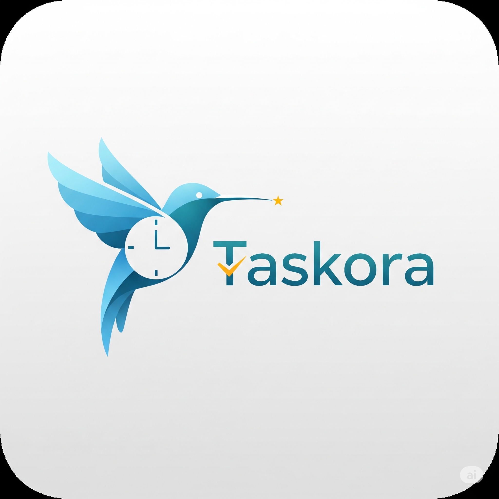

<div align="center">
  
  <h1 align="center">Taskora - Aplicação SaaS de Produtividade</h1>
  <p align="center">
    Uma aplicação web completa para gestão de tarefas, projetos e produtividade, construída com as tecnologias mais modernas do ecossistema JavaScript.
  </p>
</div>

<br />

<div align="center">
  
  
  
  
  
</div>

<br />

##  Sobre o Projeto

O Taskora nasceu de um desafio pessoal: construir uma aplicação SaaS (Software as a Service) completa, do zero, aplicando as melhores práticas de desenvolvimento de software, DevOps e arquitetura de cloud. O objetivo é criar uma ferramenta intuitiva e poderosa que ajude equipas e indivíduos a organizar o seu trabalho, a focar-se no que é importante e a analisar a sua produtividade.

Este repositório documenta toda a jornada de desenvolvimento, servindo como um portfólio prático e um testemunho das competências técnicas adquiridas.

<br />

##  Funcionalidades Principais

* **Gestão de Projetos:** Crie e organize projetos com datas, equipas e objetivos.
* **Gestão de Tarefas:** Uma visão clara de todas as suas tarefas, com prioridades e estados.
* **Kanban Board:** Visualize o seu fluxo de trabalho de forma ágil.
* **Pomodoro Timer:** Ferramenta integrada para maximizar o foco e a produtividade.
* **Analytics & Relatórios:** Dashboards para analisar o desempenho e identificar padrões.
* **Autenticação Segura:** Sistema de registo e login com encriptação e tokens JWT.
* **Interface Responsiva:** Uma experiência de utilizador fluida em qualquer dispositivo.

<br />

##  Stack Tecnológica

| Camada       | Tecnologia                                                                                                                                                             |
| :----------- | :--------------------------------------------------------------------------------------------------------------------------------------------------------------------- |
| **Frontend** | [Next.js](https://nextjs.org/), [React](https://reactjs.org/), [TypeScript](https://www.typescriptlang.org/), [Tailwind CSS](https://tailwindcss.com/)                    |
| **Backend** | [Node.js](https://nodejs.org/), [Express](https://expressjs.com/), [Prisma](https://www.prisma.io/)                                                                        |
| **Base de Dados** | [PostgreSQL](https://www.postgresql.org/)                                                                                                                            |
| **DevOps** | [Docker](https://www.docker.com/), [GitHub Actions](https://github.com/features/actions), [Terraform](https://www.terraform.io/)                                         |
| **Cloud** | [AWS](https://aws.amazon.com/) (ECS, RDS, S3)                                                                                                                            |

<br />

##  Como Executar Localmente

Siga estes passos para ter uma cópia do projeto a funcionar na sua máquina.

### Pré-requisitos

* [Node.js](https://nodejs.org/en/) (versão 20.x ou superior)
* [Docker](https://www.docker.com/products/docker-desktop/)
* Git

### Instalação

1.  **Clone o repositório:**
    ```sh
    git clone [https://github.com/o-seu-username/taskora-app.git](https://github.com/o-seu-username/taskora-app.git)
    cd taskora-app
    ```

2.  **Instale as dependências do Frontend:**
    ```sh
    cd client
    npm install
    ```

3.  **Instale as dependências do Backend:**
    ```sh
    cd ../api
    npm install
    ```

4.  **Configure as Variáveis de Ambiente (Backend):**
    * Na pasta `api`, renomeie o ficheiro `.env.example` (terá de o criar) para `.env`.
    * Preencha a `DATABASE_URL` conforme necessário.

5.  **Inicie a Base de Dados com Docker:**
    * A partir da pasta `api`, execute:
    ```sh
    docker-compose up -d
    ```

6.  **Aplique as migrações da Base de Dados:**
    * Ainda na pasta `api`, execute:
    ```sh
    npx prisma migrate dev
    ```

### Execução

1.  **Inicie o servidor do Backend:**
    * Num terminal, a partir da pasta `api`:
    ```sh
    npm run dev
    ```
    *O servidor estará a correr em `http://localhost:3001`.*

2.  **Inicie o servidor do Frontend:**
    * Noutro terminal, a partir da pasta `client`:
    ```sh
    npm run dev
    ```
    *A aplicação estará acessível em `http://localhost:3000`.*

<br />

## 📈 Estado do Projeto

Atualmente, o projeto está na fase de desenvolvimento do backend, com a interface do utilizador (UI) já completa. O próximo grande marco é a implementação da autenticação e da API para gestão de tarefas.
